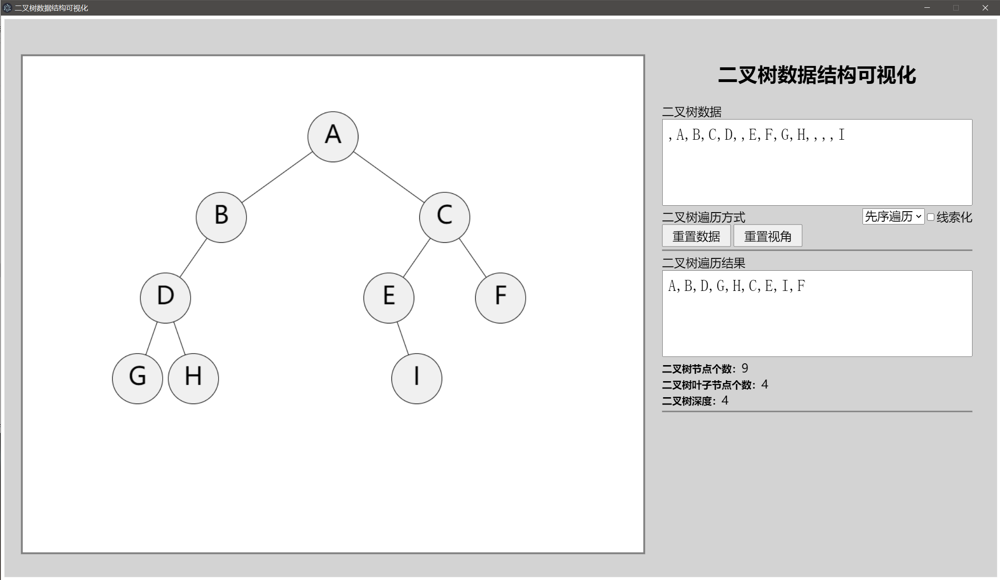
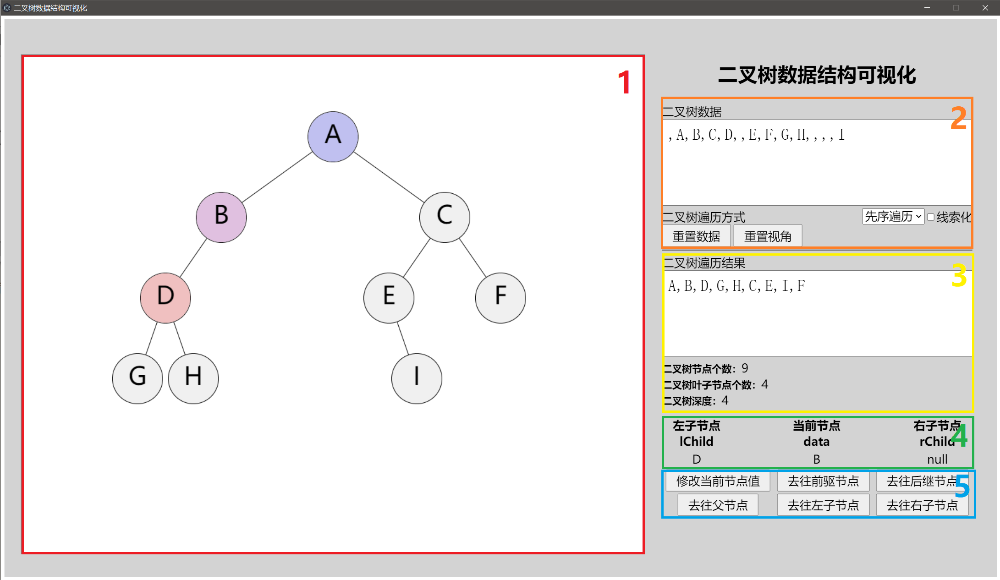
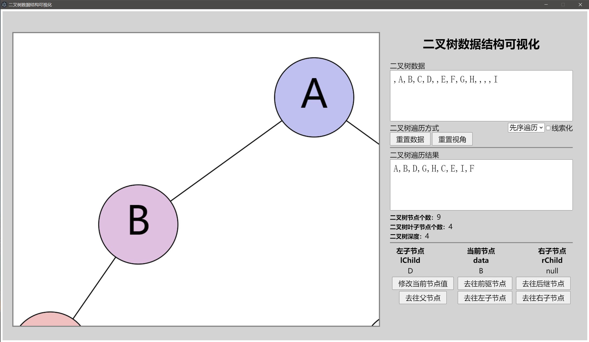

# Binary_tree_visualization

[toc]

## 简介

这是一个二叉树可视化程序，是我的《数据结构与算法设计》的课程设计作业。

这个程序提供以下功能：

- 建立一棵二叉树
- 对二叉树进行先序、中序、后续遍历
- 统计二叉树的节点个数、叶子节点个数、二叉树深度
- 实现线索化
- 图形化显示二叉树

项目中使用了 [coderaiser/smalltalk](https://github.com/coderaiser/smalltalk) 做对话框，使用了 [7-zip](https://www.7-zip.org/) 压缩项目可执行文件。

## 开发环境

- NodeJS v14.17.3
- electron v13.1.7

## 开始使用

有三种使用方式：

1. 如果已经安装了 nodejs 和 electron 的环境，在项目目录下，输入 `npm run start` 即可开始使用。
2. 可以在 release 里找我打包好的可执行文件 `binary_tree_visualization.exe`，但只支持了 windows 64位（似乎会弹一个未知发布者对信息进行更改的警告窗）。
3. 直接打开项目目录下的 web/index.html （web目录下的其他文件也需要在一个目录下）。

如果见到了这个：

那么你现在就可以开始愉快地使用了。

## 使用指南

### 界面介绍

软件界面可以分为 5 个部分：

1. 可视化区：提供二叉树的可视化与节点的点选。
2. 编辑区：直接建立二叉树、选择遍历方式与是否线索化。也有重置二叉树与重置视角的功能。
3. 结果展示区：可以看到二叉树的遍历结果与一些统计数字。
4. 节点信息展示区：点选节点后出现，展示节点的逻辑结构。线索化后也有 `lTag`, `rTag` 的信息。
5. 二叉树修改区：点选节点后出现，小范围地修改二叉树结构。

### 编辑二叉树

可以在编辑区直接建立二叉树，与以一维数组存储二叉树的原理类似。

建立二叉树需要在输入框内填入一个以逗号分隔的一维字符串数组。下标从0开始，二叉树将以以下规则建立：

1. 以下标为1的字符串为根节点
2. 下标为 i 的字符串的节点的左子节点为下标为 2\*i 的字符串
3. 下标为 i 的字符串的节点的右子节点为下标为 2\*i+1 的字符串
4. 如果一个字符串为空字符串，那么这个字符串表示的节点不存在

可以在下拉菜单中选择先序遍历/中序遍历/后序遍历，右边的复选框选择是否进行线索化。

两个按钮可以重置二叉树结构或者重置视角。

### 操作可视化区

可视化区主要有两种操作：改变视图与节点点选。

可以鼠标拖动与滚轮缩放改变视图；单击节点可以选中节点；点击空白区域可以取消选中节点。

选中节点后当前节点为浅紫色，前驱节点为浅蓝色，后继节点为浅红色。

选中节点的状态下左边的节点信息展示区和二叉树修改区会显示出来。

### 二叉树修改区

有六个按钮：

1. 修改当前节点值

	修改目前节点的值。输入空字符串即可删除节点。

2. 到前驱节点

	点选到前驱节点。

3. 到后继节点

	点选到后继节点。

4. 到父节点

	点选到父节点。

5. 到左子节点

	点选到左子节点。如果没有左子节点，即可输入字符串创建节点。

6. 到右子节点

	点选到右子节点。如果没有右子节点，即可输入字符串创建节点。